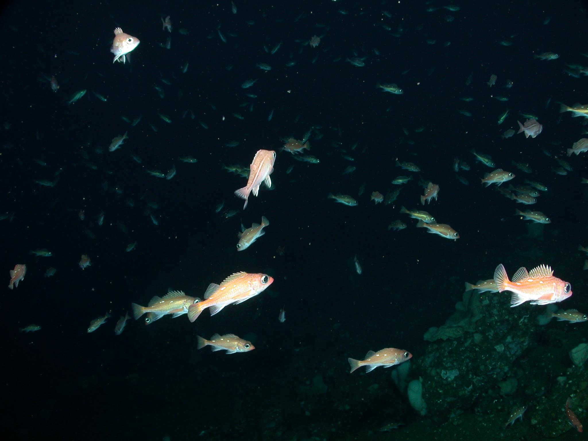
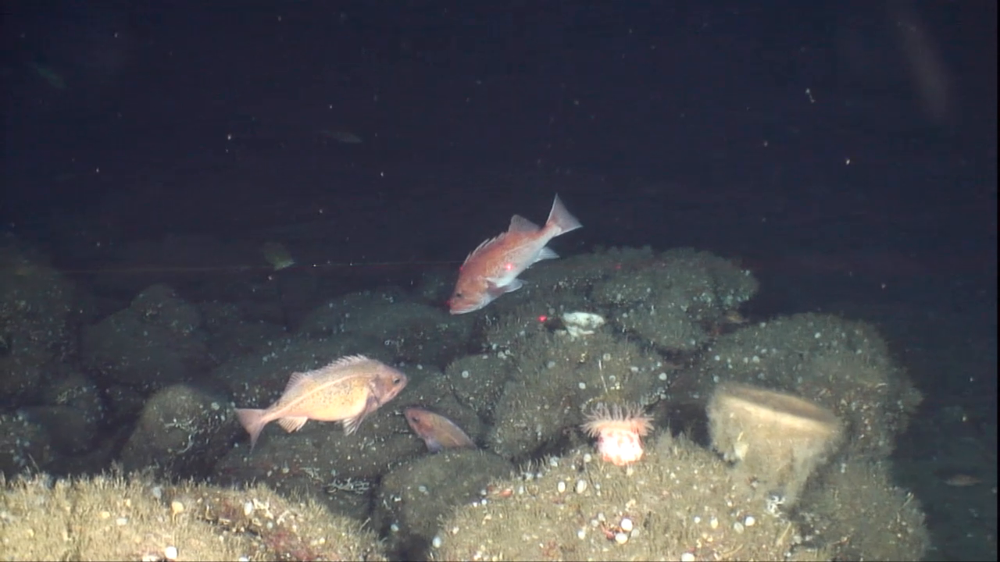

# FishDetectionInTheWild

Fish detection using dataset NOAA

The goal of this repository is to use differents deep techniques to detect and track fish using  dataset "Labeled Fishes in the Wild" which is from National Oceanic and Atmosphere Administration (NOAA Fisheries) in order to asses of automated image analysis algorithms for unconstrained underwater imagery.

The dataset includes images of fish, invertebrates, and seabed that were collected using camera systems deployed on a remotely operated vehicle (ROV) for fisheries surveys. Annotation data are included in accompanying data files (.dat .vec, and .info) that describes the locations of marked fish targets in the images.

The main paper is from (Cutter et al., 2015) It demonstrates moethods for automated detection of fish based on classifiers developed using the training image dataset, and evaluated using the test set. This dataset is offered for further development of detection of fish or invertebrates in complex evironments; tracking of multiple animal targets in video image sequences; recognition and classification of animal species measurement of animals in stereo image pairs; and characterization of seabed habitats.

This is an example of dataset image

    

This is some video from ROV which captured some fishes

     

